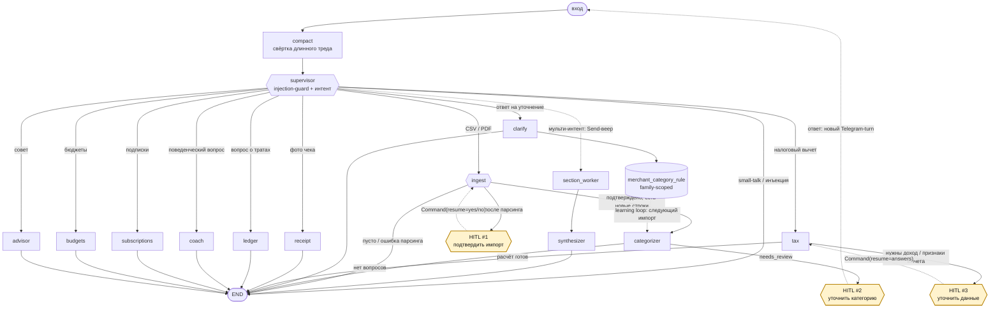
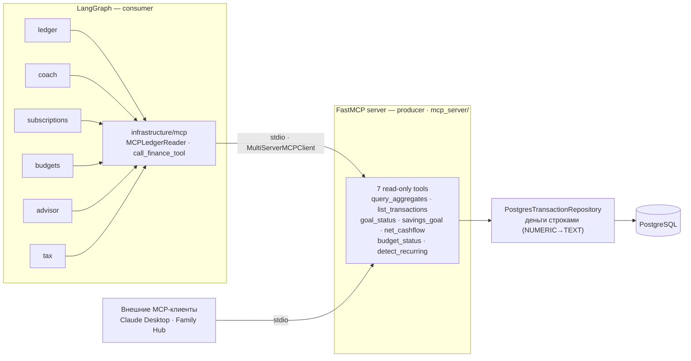

# Family Finance Assistant


Telegram-бот для семейных финансов: импортирует выписки и чеки, отвечает по истории
операций, выявляет поведенческие паттерны и оценивает налоговые вычеты.

Дипломный проект курса AI-агентов: supervisor-граф на LangGraph с 10 specialist-нодами,
human-in-the-loop, persistent state, self-hosted LangFuse и собственным MCP-сервером.

## Возможности

- **Импорт выписок** - CSV Тинькофф / PDF Сбербанк, preview и HITL-подтверждение
  перед записью, дедупликация по `import_hash`.
- **Чеки** - распознавание по QR (ФНС API `proverkacheka`) или по фото (vision-LLM).
- **Категоризация** - merchant rules → structured-output LLM → HITL-уточнение;
  ответы семьи сохраняются как правила для следующих импортов.
- **Вопросы о тратах** - «сколько на еду в мае?», «все расходы за апрель»
  (детерминированная SQL-агрегация через MCP).
- **Составные запросы** - параллельный `Send`-веер для трат, бюджетов, подписок,
  рекомендаций и налогов с детерминированным fan-in.
- **Подписки** - детект повторяющихся списаний и забытых «зомби-подписок».
- **Бюджеты и цели** - алерты при превышении лимита, прогресс по накоплениям.
- **Поведенческие инсайты** - «когда я в последний раз так тратил?» через episodic-память (Graphiti).
- **Расчёт налоговых вычетов** - pure-domain расчет на `Decimal`; недостающие данные
  запрашиваются через HITL `interrupt/resume`.
- **Приватность** - маскирование PII (Presidio) перед облачным LLM + injection-guard.

## Стек

- **LangGraph 1.2.x** — supervisor pattern
- **Telegram** — aiogram 3.x (главный интерфейс)
- **OpenRouter** — multi-provider LLM gateway через `langchain-openrouter`
- **PostgreSQL 17** — persistence + LangGraph checkpointer (`PostgresSaver`)
- **LangFuse self-host** — observability, evals, prompt management
- **FalkorDB + Graphiti** — episodic memory (поведенческие паттерны)
- **MCP** — свой FastMCP read-only сервер (`fastmcp`) + LangGraph-потребитель (`langchain-mcp-adapters`)
- **Presidio** — маскирование PII перед отправкой в cloud-LLM (+ injection guard)

## Архитектура

```
src/family_finance/
├── domain/            # Pure Pydantic — транзакции, чеки, бюджеты, цели, налоговый расчёт
├── application/       # Protocol-ports (сценарии — ноды LangGraph в agents/)
├── infrastructure/    # Postgres, parsers, LLM, memory, observability, MCP, security
├── agents/            # LangGraph: state, supervisor, compaction, specialists, workers
├── mcp_server/        # FastMCP read-only сервер (interface-слой, как bot/)
└── bot/               # Telegram (aiogram)
```

Новые агенты добавляются в `agents/`, новые источники данных — в `infrastructure/`.

## Схема графа

Граф сочетает условный routing, параллельный `Send`-веер, три HITL-взаимодействия
и learning loop категоризации:

- На входе — нода **`compact`**: сворачивает длинный тред в краткую сводку, как
  только накапливается >20 сообщений (rolling summary через `RemoveMessage`); ниже
  порога — no-op без LLM. Это предобработка, не маршрутизация (всегда → `supervisor`).
- **`supervisor`** после injection-guard выбирает intent: один
  интент → одна specialist-нода; мульти-интент («траты + подписки + совет») → веер
  `Send` на `section_worker` (orchestrator-worker) с join в `synthesizer`;
  small-talk / заблокированная инъекция → `END`.
- **HITL import**: `ingest` после чистого парсинга вызывает `interrupt()`; кнопка
  или текст возобновляет ту же ноду через `Command(resume=...)`. Запись начинается
  только после подтверждения.
- **HITL clarification**: `categorizer` сохраняет `open_questions`; ответ приходит
  следующим Telegram-turn и маршрутизируется в `clarify`.
- **HITL tax**: `tax` при нехватке данных вызывает `interrupt()` и продолжает расчет
  после resume.
- **Learning loop**: `clarify` сохраняет family-scoped merchant rule; следующий
  импорт использует его до LLM и обычно больше не задает тот же вопрос.



Сплошные стрелки показывают переходы внутри run. Пунктиром отмечены resume/cross-turn
переходы и learning loop, влияющий на будущие импорты.

## RAG / Retrieval

Классический документный RAG проекту **не нужен**: основные данные — структурированные транзакции в Postgres, и точные ответы даёт SQL-агрегация (через MCP-инструменты), а не приближённый векторный поиск. Семантический retrieval всё же присутствует там, где он уместен:

- **Episodic retrieval (Graphiti).** `coach`-нода (ReAct поверх MCP-инструментов)
  на поведенческие вопросы («когда я в последний раз так тратил?») берёт
  датированные факты из SQL-агрегатов, а качественный контекст — опциональным
  инструментом `recall_episodes` → `search_episodes`: семантический поиск по графу
  эпизодов в FalkorDB ([coach.py](src/family_finance/agents/coach.py)).

## MCP-слой

Курс требует связку **MCP + LangGraph**. Проект демонстрирует **обе** стороны
протокола: свой read-only **сервер** (producer) и LangGraph-узлы как **потребитель**
(consumer). 

- **Producer** — `mcp_server/server.py` на `FastMCP` (транспорт stdio): 7 read-only
  инструментов поверх репозитория, без записи в БД. Деньги пересекают границу
  **строками** (репозиторий кастит `NUMERIC→TEXT`) — ни один `float` не уходит в протокол.
- **Consumer** — read-узлы графа (`ledger`, `coach`, `subscriptions`, `budgets`,
  `advisor`, `tax`) читают агрегаты **через MCP-инструменты**, а не напрямую из
  репозитория. Клиентская обвязка — `infrastructure/mcp/`: `MultiServerMCPClient`
  (stdio) + `MCPLedgerReader` (repo-образный фасад, восстанавливает доменные объекты
  из JSON) и `call_finance_tool` (прямой вызов для ReAct-нод `coach`/`ledger`).
- Тот же сервер переиспользуем внешними MCP-клиентами.



`just run` запускает бот, который сам поднимает и прогревает MCP stdio subprocess.

```bash
just mcp         # запустить MCP-сервер по stdio (для Claude Desktop / внешних агентов)
just check-mcp   # сервер стартует и отдаёт список инструментов (БД не нужна)
```

## Quick start

### Требования

- Python 3.12+
- Docker + Docker Compose
- [uv](https://docs.astral.sh/uv/) — `curl -LsSf https://astral.sh/uv/install.sh | sh`
- [just](https://github.com/casey/just) — `pacman -S just` (Manjaro)

### Запуск

```bash
# 1. Установка
just install
just init-env        # копирует .env.example → .env

# 2. Заполни .env:
#    - TELEGRAM_BOT_TOKEN (от @BotFather)
#    - TELEGRAM_ALLOWED_USER_IDS (твой telegram user_id; пустой список закрывает доступ)
#    - OPENROUTER_API_KEY

# 3. Инфра
just up              # postgres + falkordb (Graphiti) + langfuse — 8 контейнеров
just check-langfuse  # LangFuse healthy
just check-llm       # OpenRouter key + модели

# 4. LangFuse UI
# Открой http://localhost:3001
# Логин: admin@local.dev / admin12345

# 5. Бот
just run
# Напиши /start своему боту в Telegram
# Trace появится в LangFuse: http://localhost:3001/project/ff-project/traces
```

## Команды разработчика

```bash
just              # список команд
just lint         # ruff + mypy
just fmt          # auto-format
just test         # unit tests
just test-all     # все тесты включая интеграционные
just eval         # eval-сюита, включая LLM-as-judge
just eval-report  # загрузить datasets/experiment в LangFuse
just printgraph   # сгенерировать docs/graph.mmd из текущего StateGraph
just mcp          # запустить MCP-сервер (stdio)
just check-mcp    # MCP-сервер стартует и отдаёт инструменты
just smoke        # инфра + проверки + инструкция
just logs <svc>   # логи сервиса
just nuke         # ⚠ удаление volumes
```

## Структура проекта (полная)

```
family-finance/
├── docs/
│   ├── ARCHITECTURE.md
│   ├── SECURITY.md           # PII-маскирование + injection guard, ФЗ-152
│   └── adr/                  # Architecture Decision Records
│
├── infra/
│   └── postgres-init/        # DDL для domain tables
│
├── src/family_finance/
│   ├── domain/               # Pure entities
│   ├── application/          # Ports (Protocols); сценарии — ноды LangGraph в agents/
│   ├── infrastructure/       # LLM, memory, observability, MCP-client, security, settings
│   ├── agents/               # LangGraph supervisor + specialist-ноды
│   ├── mcp_server/           # FastMCP read-only сервер (MCP producer)
│   └── bot/                  # aiogram handlers
│
└── tests/
    ├── unit/                 # Pure domain tests
    ├── integration/          # С docker-сервисами
    └── evals/                # 29 кейсов + LangFuse datasets/experiments
```

## Security-чеклист

Полное описание — [docs/SECURITY.md](docs/SECURITY.md). Статусы: ✅ реализовано ·
🚫 неприменимо · ⏳ открыто.

| Пункт | Статус | Как / почему |
|---|---|---|
| Защита от prompt-injection (input) | ✅ | `injection_guard`: детерм. паттерны RU+EN + gated LLM-judge ([injection_guard.py](src/family_finance/infrastructure/security/injection_guard.py)) |
| Маскирование PII перед cloud-LLM | ✅ | Presidio в единственном LLM-чокпоинте `MaskingChatModel` (телефон/карта/email/IBAN/IP) |
| Секреты вне кода и git | ✅ | `Settings`/`.env`, pre-commit ловит `.env`; в код ходим только через `get_settings()` |
| Авторизация доступа к боту | ✅ | allowlist `TELEGRAM_ALLOWED_USER_IDS`; пустой список закрывает доступ |
| Read-only граница наружу (MCP) | ✅ | MCP-сервер не пишет в БД, деньги пересекают границу строками (`NUMERIC→TEXT`) |
| Output-валидация структуры LLM | ✅ | `with_structured_output(Schema)` вместо парсинга строк регексом |
| Ограниченная поверхность внешних API | ✅ | интеграции фиксированы: Telegram, OpenRouter (включая точечный online search) и ProverkaCheka; произвольного URL-fetch tool нет |
| Маскирование имён (PERSON-NER) | ⏳ | требует тяжёлой `ru_core_news_md`; осознанно отложено (см. SECURITY.md) |
| Трансграничная передача (ФЗ-152) | ⏳ | OpenRouter — зарубежные провайдеры; для прод-ФЗ-152 нужен локальный инференс |
| Rate-limiting / anti-DoS | ⏳ | single-family дипломный бот за allowlist; не приоритет до публичного деплоя |
| Output-guardrail на «галлюцинацию чисел» | 🚫 | числа берутся из SQL-агрегатов, LLM лишь формулирует — не генерирует суммы |
| Шифрование БД at-rest | 🚫 | self-host dev-окружение; в прод — на уровне инфраструктуры, вне кода |

## Метрики

| Метрика | Значение | Как измеряется |
|---|---|---|
| Success rate (evals) | **100%** (29/29) | доля `pass` по 29 кейсам, `just eval` (pytest-гейт, все скореры вкл. llm_judge): categorization 11, cascade 3, csv 2, security 3, routing 4, multi-intent 6. `just eval-report` дублирует детерминированный субсет в LangFuse Dataset Run для дашборда |
| Latency median (per run) | **≈1.5 с** | медиана длительности `graph.ainvoke` по 12 запросам core-пути (steady-state); стабильна между прогонами (1.45 / 1.66 с) — это стоимость графа + типичного ответа LLM |
| Latency p95 (per run) | **≈23 с** | p95 по тем же 12 запросам; воспроизводимо высок (22.6 / 23.2 с), но определяется хвостом латентности LLM-провайдера (`gemini-flash`/OpenRouter), не графом |
| Cost per run (avg) | **≈$0.0002** | стоимость трейса (едет автоматически через callback), диапазон $0–$0.0005, worker `gemini-2.5-flash` |

## Licensing

MIT.
