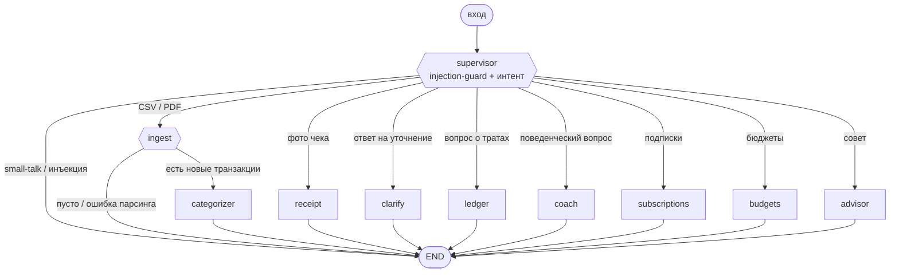
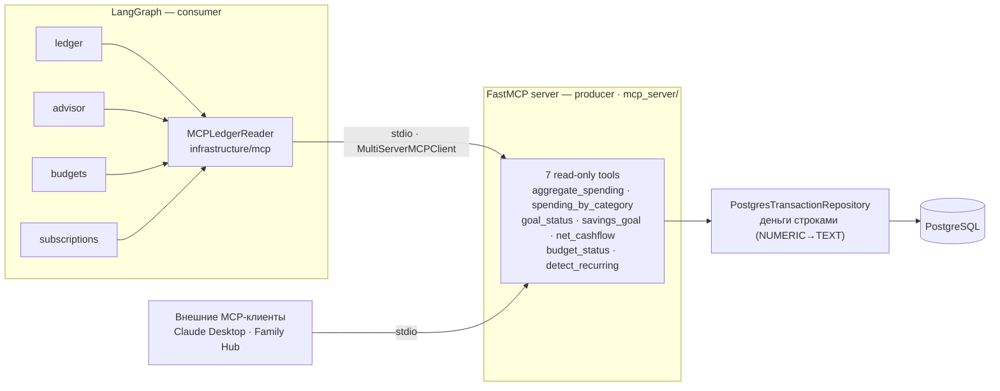

# Family Finance Assistant

> Telegram-бот, который превращает банковские выписки и фото чеков в понятную картину семейных финансов.


Дипломный проект курса AI-агентов: multi-agent система на LangGraph (supervisor + 9
специалистов), persistent-память, observability в LangFuse и собственный MCP-сервер.

## Возможности

- **Импорт выписок** — CSV Тинькофф / PDF Сбербанк, дедупликация по import-hash.
- **Чеки** — распознавание по QR (ФНС API `proverkacheka`) или по фото (vision-LLM).
- **Категоризация** — LLM со structured output; низкая уверенность → уточняющие вопросы.
- **Вопросы о тратах** — «сколько на еду в мае?», «все расходы за апрель» (SQL-агрегация через MCP).
- **Подписки** — детект повторяющихся списаний и забытых «зомби-подписок».
- **Бюджеты и цели** — алерты при превышении лимита, прогресс по накоплениям.
- **Поведенческие инсайты** — «когда я в последний раз так тратил?» через episodic-память (Graphiti).
- **Приватность** — маскирование PII (Presidio) перед облачным LLM + injection-guard.

## Стек

- **LangGraph 1.2.x** — supervisor pattern
- **Telegram** — aiogram 3.x (главный интерфейс)
- **OpenRouter** — multi-provider LLM gateway через `langchain-openrouter`
- **PostgreSQL 17** — persistence + LangGraph checkpointer (`PostgresSaver`); pgvector — план Phase 2 (см. RAG ниже)
- **LangFuse self-host** — observability, evals, prompt management
- **FalkorDB + Graphiti** — episodic memory (поведенческие паттерны)
- **MCP** — свой FastMCP read-only сервер (`fastmcp`) + LangGraph-потребитель (`langchain-mcp-adapters`)
- **Presidio** — маскирование PII перед отправкой в cloud-LLM (+ свой injection guard)

## Архитектура

```
ff/
├── domain/            # Pure Pydantic — Transaction, Receipt, Family, Budget, SavingsGoal, Subscription, DigestSchedule
├── application/       # Protocol-ports (сценарии — ноды LangGraph в agents/)
├── infrastructure/    # Adapters: LLM, memory, observability, MCP-client, settings
├── agents/            # LangGraph: state, supervisor, 9 specialist-нод
├── mcp_server/        # FastMCP read-only сервер (interface-слой, как bot/)
└── bot/               # Telegram (aiogram)
```

Новые агенты добавляются в `agents/`, новые источники данных — в `infrastructure/`.

## Схема графа

LangGraph-граф нелинейный, с **двумя точками ветвления** (роутинг в Python, не в
промпте — см. [supervisor.py](src/ff/agents/supervisor.py)):

1. **`supervisor`** — после injection-guard классифицирует интент и направляет в
   одного из специалистов (или `END` для small-talk / заблокированной инъекции).
2. **`ingest`** — после парсинга выписки направляет в `categorizer`, только если
   появились новые транзакции; пустой импорт / ошибка парсинга идут в `END`.



## RAG / Retrieval

Классический документный RAG (chunk → embed → retrieve → stuff в промпт) проекту
**не нужен**: основные данные — структурированные транзакции в Postgres, и точные
ответы даёт SQL-агрегация (через MCP-инструменты), а не приближённый векторный
поиск. Семантический retrieval всё же присутствует там, где он уместен:

- **Episodic retrieval (Graphiti).** `coach`-нода отвечает на поведенческие вопросы
  («когда я в последний раз так тратил?») через `search_episodes` —
  семантический поиск по графу эпизодов в FalkorDB
  ([coach.py](src/family_finance/agents/coach.py)).

## MCP-слой

Курс требует связку **MCP + LangGraph**. Проект демонстрирует **обе** стороны
протокола: свой read-only **сервер** (producer) и LangGraph-узлы как **потребитель**
(consumer).

- **Producer** — `mcp_server/server.py` на `FastMCP` (транспорт stdio): 7 read-only
  инструментов поверх репозитория, без записи в БД. Деньги пересекают границу
  **строками** (репозиторий кастит `NUMERIC→TEXT`) — ни один `float` не уходит в протокол.
- **Consumer** — read-узлы графа (`ledger`, `advisor`, `budgets`, `subscriptions`) читают
  агрегаты **через MCP-инструменты**, а не напрямую из репозитория. Клиентская обвязка —
  `infrastructure/mcp/`: `MultiServerMCPClient` (stdio) + `MCPLedgerReader` —
  repo-образный фасад, который восстанавливает доменные объекты из JSON.
- Тот же сервер переиспользуем внешними MCP-клиентами (Claude Desktop, будущий Family Hub).



```bash
just mcp         # запустить MCP-сервер по stdio (для Claude Desktop / внешних агентов)
just check-mcp   # сервер стартует и отдаёт список инструментов (БД не нужна)
```

## Quick start

### Требования

- Python 3.12+
- Docker + Docker Compose
- [uv](https://docs.astral.sh/uv/) — `curl -LsSf https://astral.sh/uv/install.sh | sh`
- [just](https://github.com/casey/just) — `pacman -S just` (Manjaro)

### Запуск

```bash
# 1. Установка
just install
just init-env        # копирует .env.example → .env

# 2. Заполни .env:
#    - TELEGRAM_BOT_TOKEN (от @BotFather)
#    - TELEGRAM_ALLOWED_USER_IDS (твой telegram user_id; пустой список закрывает доступ)
#    - OPENROUTER_API_KEY

# 3. Инфра
just up              # postgres + falkordb (Graphiti) + langfuse — 8 контейнеров
just check-langfuse  # LangFuse healthy
just check-llm       # OpenRouter key + модели

# 4. LangFuse UI
# Открой http://localhost:3001
# Логин: admin@local.dev / admin12345

# 5. Бот
just run
# Напиши /start своему боту в Telegram
# Trace появится в LangFuse: http://localhost:3001/project/ff-project/traces
```

## Команды для разработки

```bash
just              # список команд
just lint         # ruff + mypy --strict
just fmt          # auto-format
just test         # unit tests
just test-all     # все тесты включая интеграционные
just cov          # тесты + отчёт о покрытии
just eval         # прогон eval-сюиты (LangFuse)
just printgraph   # отрисовать граф LangGraph
just mcp          # запустить MCP-сервер (stdio)
just check-mcp    # MCP-сервер стартует и отдаёт инструменты
just smoke        # инфра + проверки + инструкция
just nuke         # ⚠ удаление volumes
```

## Структура проекта

```
ff/
├── docs/
│   ├── ARCHITECTURE.md
│   ├── ROADMAP.md            # фазы 0 → диплом → Family Hub
│   ├── SECURITY.md           # PII-маскирование + injection guard, ФЗ-152
│   └── adr/                  # Architecture Decision Records
│
├── infra/
│   └── postgres-init/        # DDL для domain tables
│
├── src/family_finance/
│   ├── domain/               # Pure entities
│   ├── application/          # Ports (Protocols); сценарии — ноды LangGraph в agents/
│   ├── infrastructure/       # LLM, memory, observability, MCP-client, security, settings
│   ├── agents/               # LangGraph supervisor + specialist-ноды
│   ├── mcp_server/           # FastMCP read-only сервер (MCP producer)
│   └── bot/                  # aiogram handlers
│
└── tests/
    ├── unit/                 # Pure domain tests
    ├── integration/          # С docker-сервисами
    └── evals/                # 19 кейсов + LangFuse datasets/experiments
```

## Security-чеклист

| Пункт | Статус | Как / почему |
|---|---|---|
| Защита от prompt-injection (input) | ✅ | `injection_guard`: детерм. паттерны RU+EN + gated LLM-judge ([injection_guard.py](src/family_finance/infrastructure/security/injection_guard.py)) |
| Маскирование PII перед cloud-LLM | ✅ | Presidio в единственном LLM-чокпоинте `MaskingChatModel` (телефон/карта/email/IBAN/IP) |
| Секреты вне кода и git | ✅ | `Settings`/`.env`, pre-commit ловит `.env`; в код ходим только через `get_settings()` |
| Авторизация доступа к боту | ✅ | allowlist `TELEGRAM_ALLOWED_USER_IDS`; пустой список закрывает доступ |
| Read-only граница наружу (MCP) | ✅ | MCP-сервер не пишет в БД, деньги пересекают границу строками (`NUMERIC→TEXT`) |
| Output-валидация структуры LLM | ✅ | `with_structured_output(Schema)` вместо парсинга строк регексом |
| Allowlist доменов для внешних API | ✅ | внешних HTTP-вызовов два: OpenRouter и proverkacheka.com (ФНС), оба захардкожены |
| Маскирование имён (PERSON-NER) | ⏳ открыто | требует тяжёлой `ru_core_news_md`; осознанно отложено (см. SECURITY.md) |
| Трансграничная передача (ФЗ-152) | ⏳ открыто | OpenRouter — зарубежные провайдеры; для прод-ФЗ-152 нужен локальный инференс |
| Rate-limiting / anti-DoS | ⏳ открыто | single-family дипломный бот за allowlist; не приоритет до публичного деплоя |
| Output-guardrail на «галлюцинацию чисел» | 🚫 неприменимо | числа берутся из SQL-агрегатов, LLM лишь формулирует — не генерирует суммы |
| Шифрование БД at-rest | 🚫 неприменимо | self-host dev-окружение; в прод — на уровне инфраструктуры, вне кода |

## Документация

- [docs/ARCHITECTURE.md](docs/ARCHITECTURE.md) — слои, граница domain/application/infrastructure, пирамида памяти
- [docs/SECURITY.md](docs/SECURITY.md) — маскирование PII, injection guard, чек-лист ФЗ-152
- [docs/adr/](docs/adr/) — Architecture Decision Records (LangGraph, LangFuse, OpenRouter, MCP)

## Лицензия

[MIT](LICENSE) © 2026 Yuri
