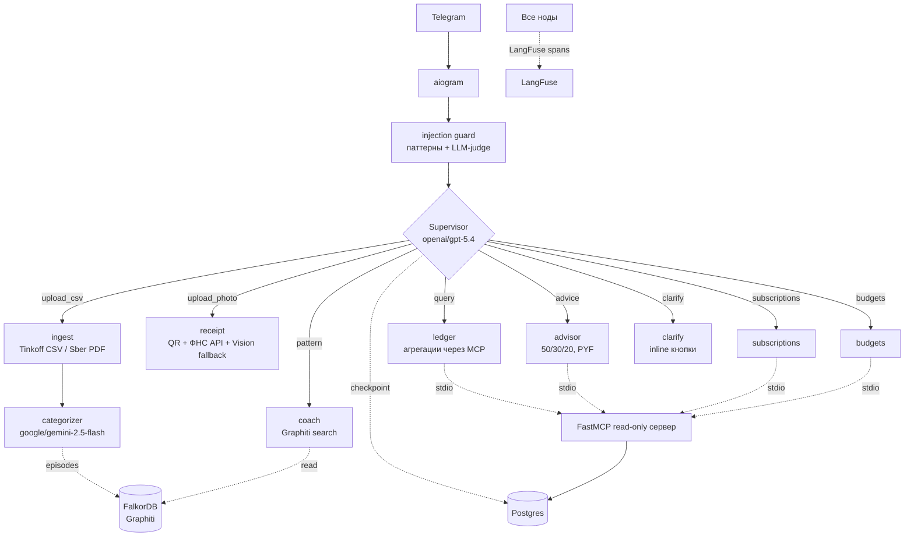

# Architecture

## Принципы

1. **Clean Architecture** — Domain → Application → Infrastructure → Interfaces
2. **Hexagonal / Ports & Adapters** — LangGraph, aiogram, OpenRouter, LangFuse — это adapters; завтра меняем — domain не трогаем
3. **Contract-first** — Pydantic v2 на границах нод
4. **Observable by default** — OTEL/LangFuse 
5. **Memory pyramid с явными declarations** — каждый агент знает что читает/пишет

## Диаграмма (текущее состояние)

Supervisor классифицирует intent и через `add_conditional_edges` (routing в Python)
направляет в одну из specialist-нод. Перед роутингом — security-фильтр (injection guard);
все LLM-вызовы идут через один маскирующий фасад (Presidio PII).

Все LLM-вызовы (`get_chat_model`) обёрнуты в `MaskingChatModel` — PII маскируется
Presidio перед уходом в OpenRouter. Детали — [SECURITY.md](SECURITY.md).

## Memory Pyramid

| Layer | Backend | Статус | Что хранит |
|-------|---------|--------|------------|
| Working | PostgresSaver | ✅ | LangGraph state (checkpointer) |
| Episodic | Graphiti + FalkorDB | ✅ | "что произошло когда" — поведенческие паттерны |
| Semantic | pgvector | ⏳ план | факты (НК РФ, описания магазинов, гарантии) |
| Procedural | Mem0/LangMem | ⏳ план | "когда вижу X — обычно делаю Y" |

## Слои

### Domain
- Сущности (Entity, изменяемые): `Transaction`, `Family`, `FamilyMember` — Pydantic v2
- Value-объекты (frozen): `ReceiptItem`; вычисляемые/детектируемые `Budget`/`BudgetStatus`,
  `SavingsGoal`/`GoalProgress`, `Subscription`, `DigestSchedule`
- Чек: `Receipt` (+ `ReceiptItem` с проверкой `total ≈ quantity*price`)
- Битемпоральность (`occurred_at` + `ingested_at`), все datetime — tz-aware UTC
- `amount > 0` + `Direction` enum (нельзя перепутать знак)
- `Decimal` для денег, не float

### Application
- `Protocol`-ports (`TransactionRepository`, `BankStatementParser`)
- Сценарии (categorize/ingest/report) живут в `agents/` как ноды LangGraph,
  отдельных use-case модулей нет — в пакете только порты (`ports.py`)

### Infrastructure
- `llm/openrouter_client.py` — `ChatOpenRouter` за фасадом `get_chat_model(tier=...)`, обёрнут в `MaskingChatModel`
- `parsers/` — `TinkoffCsvParser`, `SberPdfParser`, Vision-receipt
- `memory/checkpointer.py` — PostgresSaver context manager; `memory/graphiti_client.py` — episodic
- `security/` — `presidio_pii.py` (маскирование) + `injection_guard.py` (паттерны + LLM-judge)
- `mcp/` — `MultiServerMCPClient` + `MCPLedgerReader` (consumer-обвязка)
- `observability/langfuse_setup.py` — singleton client + per-invoke callback
- `settings.py` — pydantic-settings

### Agents
- `state.py` — `FinanceState` TypedDict с reducer-ами + `Intent` literal
- `supervisor.py` — routing + регистрация всех specialist-нод
- Ноды: `ingest`, `categorizer`, `receipt`, `ledger`, `coach`, `subscriptions`, `budgets`, `advisor`, `clarify`, `digest`
- В каждом узле: input/output Pydantic schemas, LLM call через `get_chat_model`

### Interfaces
- `bot/` — `aiogram 3.x` с `Router`-ами; whitelist по `telegram_user_id` (пустой список закрывает доступ); APScheduler для weekly-digest; каждый invoke прокидывает LangFuse callback с user/session/tags
- `mcp_server/` — `FastMCP` read-only сервер (stdio), 7 инструментов поверх репозитория

## Расширяемость

| Хочу… | Куда добавлять |
|-------|----------------|
| Новый банк-формат | `infrastructure/parsers/sberbank.py` + регистрация в `BankSource` |
| Новый агент | `agents/<name>.py` + node в `supervisor.build_supervisor_graph()` |
| Новый source memory | `infrastructure/memory/<name>.py` + Protocol в `application/ports.py` |
| Новый интерфейс (Web) | `web/` рядом с `bot/`, переиспользует `agents/` и `infrastructure/` |
