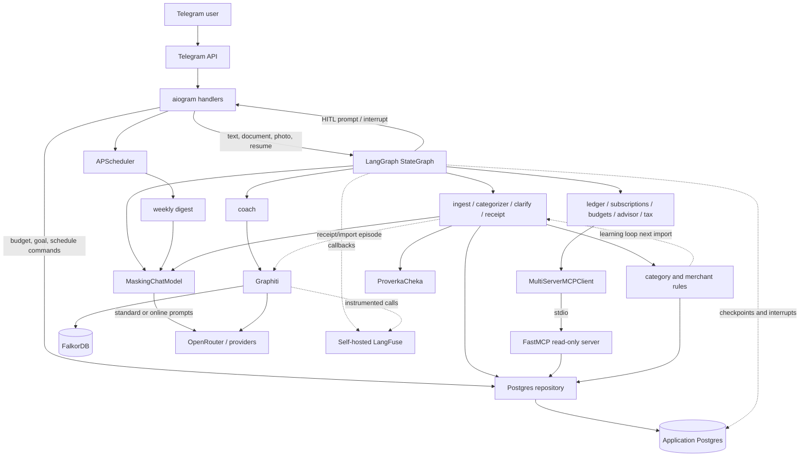
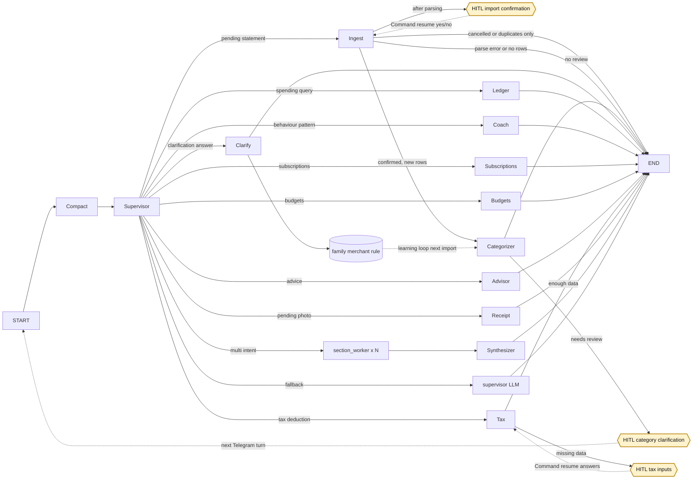

# Архитектура

## Принципы

1. **Domain first.** Pydantic-сущности не зависят от aiogram, LangGraph, БД и LLM.
2. **Ports and adapters.** Application определяет `Protocol`-контракты, infrastructure
   реализует Postgres, parsers, LLM, memory и MCP.
3. **Детерминированность до LLM.** Keyword routing, SQL-агрегации, deduplication,
   budgets, recurring detection и налоговые расчеты выполняются кодом; LLM используется
   для классификации, ограниченного planning и текста.
4. **Явная семейная область.** Финансовые запросы и записи всегда получают `family_id`.
5. **Decimal и полуинтервалы.** Деньги не проходят через `float`; периоды задаются
   как `[start, end)`.
6. **Наблюдаемость по умолчанию.** Каждый graph invoke получает LangFuse callback и
   session metadata.
7. **Fail-soft для вторичных функций.** Ошибка Graphiti, narrative LLM или alert не
   должна повреждать основную запись транзакций.

## Контекст системы

## Runtime

При старте `python -m family_finance.bot`:

1. Загружаются type-safe settings из `.env`.
2. Инициализируется LangFuse client.
3. Создается Telegram bot и dispatcher.
4. Graphiti пытается создать индексы в FalkorDB; ошибка не блокирует запуск.
5. `AsyncPostgresSaver.setup()` создает checkpoint-таблицы.
6. Компилируется supervisor graph с checkpointer.
7. Один MCP stdio subprocess прогревается до запуска parallel workers.
8. Регистрируются aiogram handlers.
9. APScheduler восстанавливает сохраненные digest schedules.
10. Запускается long polling; при shutdown scheduler и MCP закрываются, LangFuse flush-ится.

## LangGraph workflow

Сплошные стрелки - переходы текущего graph run. Пунктиром показаны:

- resume-loop: `interrupt()` сохраняется PostgresSaver, Telegram вызывает
  `Command(resume=...)`, после чего `ingest` или `tax` безопасно переисполняется;
- cross-turn HITL: clarification-вопрос сохраняется в state, а ответ приходит новым run;
- learning loop: `clarify` записывает family-scoped merchant rule, который на следующем
  импорте проверяется до LLM.

`compact_node` ничего не делает до 20 сообщений. После порога он передает старую
часть истории worker-модели, заменяет ее rolling summary и сохраняет последние
8 сообщений дословно.

`supervisor_node` сначала обрабатывает trusted pending upload flags, затем для
пользовательского текста запускает injection guard. После него идут clarification,
keyword fast-path и детерминированный multi-intent detector. При промахе правил
structured-output planner выбирает `spending`, `budgets`, `subscriptions`, `advice`,
`tax`, pattern или small talk.

Для multi-intent запроса период разбирается один раз, независимые read-only секции
запускаются параллельно через `Send`, а `synthesizer` сортирует готовые секции по
`order` и склеивает без повторного LLM-вызова. Specialist отвечает сам; supervisor
не добавляет промежуточное сообщение.

`FinanceState` хранит:

- историю `messages`;
- `family_id`, `member_id`, Telegram user/chat ids;
- pending paths для CSV, PDF и фото;
- импортированные `Transaction`;
- структурированные `ClarificationQuestion`;
- routing flags;
- ordered multi-intent plan, общий период и накопленные `SectionResult`.

Reducer транзакций заменяет запись по `transaction_id`, а вопросы заменяются одним
активным batch. Multi-intent reducer накапливает fan-out результаты и сбрасывается
пустым списком перед новым plan. Checkpoint key - `thread_id = "tg:<chat_id>"`.
PostgresSaver хранит также pending interrupts для последующего `Command(resume=...)`.

## Основные потоки

### Импорт выписки

1. Handler проверяет Telegram allowlist, скачивает файл в `uploads/<chat_id>/`.
2. Handler отклоняет неподдерживаемое расширение и заявленный Telegram размер выше
   `MAX_UPLOAD_MB`; `%PDF-` означает Сбер PDF, остальные принятые документы идут как CSV.
3. `ingest` парсит файл без записи и вызывает `interrupt()` с банком, количеством
   операций и периодом.
4. Кнопка или текст `да`/`нет` возобновляет тот же checkpoint; только подтвержденный
   импорт вызывает idempotent `add_many` по `import_hash`.
5. Только новые строки передаются в `categorizer`.
6. Категоризация идет каскадом: fuzzy merchant rule семьи -> bounded parallel LLM
   batch с taxonomy из таблицы `category` -> clarification.
7. Неоднозначные операции группируются в вопросы с датами платежа и `import_hashes`.
8. Ответ вида `1 одежда 2 коммуналка` или inline button обновляет строки и сохраняет
   family-scoped merchant rule.
9. Свободное пояснение категоризируется LLM; ответ `не знаю` включает точечный
   OpenRouter `:online` поиск продавца. Такие правила помечаются source `llm`.
10. После категоризации один агрегированный episode на импорт отправляется в Graphiti
    в фоне; ошибки episodic memory не откатывают Postgres.

### Чек

1. Фото сохраняется локально.
2. QR декодируется локально через pyzbar; при неудаче фото отправляется vision-модели.
3. Фискальный QR передается ProverkaCheka для получения состава чека.
4. Позиции преобразуются в транзакции и записываются idempotently.
5. Один текстовый episode на чек асинхронно отправляется в Graphiti.

### Чтение и рекомендации

- `ledger` детерминированно разбирает категорию и период, вызывает
  `aggregate_spending` через MCP и только затем просит LLM сформулировать ответ.
- `subscriptions` и `budgets` используют `MCPLedgerReader`.
- `advisor` получает через MCP расходы, доход, цель и cashflow, после чего строит
  grounded prompt; есть детерминированный fallback.
- `tax` читает категории социальных вычетов и доход через MCP, при необходимости
  запрашивает данные через interrupt и считает возврат pure-domain функцией на `Decimal`.
  В multi-intent режиме используется явно помеченная best-effort оценка без HITL.
- `coach` ищет facts в Graphiti по `group_id = family_id`.
- `digest` запускается вне графа: SQL breakdown + alerts + LLM narrative + advisor block.

## Слои

### `domain/`

Pydantic v2 модели `Transaction`, `Receipt`, `Family`, `Budget`, `SavingsGoal`,
`Subscription`, `DigestSchedule`, `DeductionInput`, `DeductionEstimate` и value
objects. Денежные поля - `Decimal`, timestamps tz-aware, направление хранится
отдельно от положительной суммы. Налоговый расчет не импортирует LangGraph, БД или LLM.

### `application/`

`Protocol`-ports `TransactionRepository` и `BankStatementParser`, а также read result
`LedgerSummary`. Отдельного слоя use-case классов пока нет: orchestration сценариев
находится в `agents/` и Telegram handlers.

### `infrastructure/`

- `persistence/` - asyncpg repository и process-wide connection pool;
- `persistence/postgres_categorization.py` - taxonomy и fuzzy merchant rules;
- `parsers/` - банковские форматы, QR, ProverkaCheka и vision fallback;
- `llm/` - `ChatOpenRouter` за `MaskingChatModel`, включая optional `:online`;
- `memory/` - Postgres checkpointer и Graphiti/FalkorDB;
- `mcp/` - stdio client и repository-shaped read facade;
- `observability/` - LangFuse client/callback lifecycle;
- `security/` - PII masking и prompt-injection guard;
- `settings.py` - pydantic-settings и `SecretStr`.

### `agents/`

LangGraph state, supervisor, compaction, specialist-ноды и multi-intent workers.
Здесь допустимы orchestration и user-facing formatting, но не Telegram-specific I/O.

### Интерфейсы

- `bot/` - aiogram handlers и APScheduler;
- `mcp_server/` - семь read-only FastMCP tools поверх repository.

## Данные и память

| Хранилище | Назначение | Source of truth |
|---|---|---|
| Application Postgres | семьи, участники, транзакции, taxonomy/rules, бюджеты, цели, schedules | Да |
| PostgresSaver tables | LangGraph messages/state/interrupts по thread | Только workflow state |
| FalkorDB | Graphiti import/receipt episodes и edges для coach | Нет, производное хранилище |
| LangFuse Postgres/ClickHouse/MinIO | traces, generations, datasets, scores | Observability |
| `uploads/` | исходные CSV/PDF/JPEG | Временное по назначению, но автоочистки пока нет |

`pgvector` extension включено, но semantic document memory не реализована.
Procedural memory через Mem0/LangMem также не реализована.

## MCP boundary

FastMCP server запускается одним дочерним процессом по stdio и публикует семь read
tools: aggregates, transaction list/breakdown, goal status, savings goal, net cashflow,
budget status и recurring expenses. Клиент прогревает общую сессию при startup и
сериализует concurrent tool calls через lock. Деньги передаются строками и
восстанавливаются как `Decimal`.

MCP отделяет read API от repository, но сам по себе не выполняет авторизацию: tool
доверяет переданному `family_id`. Внутренний клиент получает его из graph state.

## Расширение

| Изменение | Точки изменения |
|---|---|
| Новый bank format | parser + handler/content detection + unit samples |
| Новый graph intent | state literal при необходимости + detector + node + edge + routing/eval test |
| Новая multi-intent секция | detector/planner schema + read-only builder + order + worker test |
| Новый read capability | repository method + FastMCP tool + `MCPLedgerReader` + integration test |
| Новый write command | application/repository contract + authenticated interface handler |
| Новый HITL workflow | interrupt payload + idempotent pre-interrupt code + renderer/resume handler + tests |
| Новый memory backend | application contract при необходимости + `infrastructure/memory/` adapter |
| Новый UI | отдельный interface package, переиспользующий graph и application contracts |

## Известные архитектурные ограничения

- Use cases распределены между `agents/` и bot handlers, поэтому write-команды пока
  не имеют единого application service layer.
- Graphiti хранит один aggregate episode на массовый импорт, поэтому не поддерживает
  поиск по каждой банковской строке с полной точностью.
- Compaction является lossy: rolling summary может опустить деталь старого диалога.
- LLM planner и web lookup увеличивают внешний data flow и стоимость на keyword miss
  или ответ `не знаю`.
