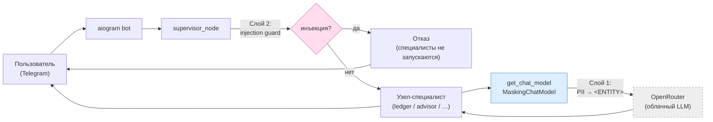

# Безопасность и приватность

Семейные финансовые данные обрабатываются облачным LLM (OpenRouter), поэтому
перед отправкой наружу применяются два независимых слоя защиты. Оба живут в
`src/family_finance/infrastructure/security/` и врезаны в единственные узкие места
графа — без правок в отдельных узлах.

## Слой 1 — Маскирование PII (Presidio)

Модуль: [`presidio_pii.py`](../src/family_finance/infrastructure/security/presidio_pii.py).
Врезан в единственный LLM-чокпоинт `get_chat_model` (`MaskingChatModel`), поэтому
**каждый** исходящий вызов анонимизируется автоматически.

- Маскируется только пользовательский текст (`HumanMessage`); наши системные
  промпты и изображения чеков не трогаются.
- Детектируются регексами/контекстом, без NER-модели (`spacy.blank("en")`):
  `PHONE_NUMBER`, `CREDIT_CARD` (с проверкой Луна), `EMAIL_ADDRESS`,
  `IBAN_CODE`, `IP_ADDRESS`. Российские номера (`+7…`, `8…`) — через
  `PhoneRecognizer(supported_regions=["RU", "US"])`.
- Найденное заменяется плейсхолдером `<ENTITY_TYPE>` (напр. `<PHONE_NUMBER>`).

PERSON-NER (имена) сознательно вне области: требует тяжёлой `ru_core_news_md`.
Регекс-набор покрывает реальные векторы утечки в рамках дипломного дедлайна.

## Слой 2 — Защита от prompt injection

Модуль: [`injection_guard.py`](../src/family_finance/infrastructure/security/injection_guard.py).
Врезан в `supervisor_node`: заблокированное сообщение коротко замыкается на отказ
до запуска любого специалиста. NeMo Guardrails отброшен как избыточный — вместо
него два дешёвых слоя:

1. **Детерминированные паттерны** (RU+EN) ловят очевидные атаки
   («ignore previous instructions», «забудь предыдущие инструкции», «ты теперь…»,
   «покажи свой промпт») за нулевую стоимость.
2. **Один LLM-judge** как семантический backstop для перефразированных атак. Он
   гейтнут по ключевым словам, поэтому обычные финансовые вопросы за него не платят.

Eval-кейсы: `tests/evals/cases/security/` (2 детерминированных + 1 семантический).

## Поток данных PII

Облачная граница — пунктирный `OpenRouter`. Всё, что её пересекает, проходит через
оба слоя: текст уже без явных PII и без переопределяющих инструкций.

## Чек-лист ФЗ-152 (что делаем / чего не делаем)

| Требование | Статус | Как |
|---|---|---|
| Минимизация ПДн на выходе наружу | ✅ | Слой 1 маскирует телефон/карту/email/IBAN/IP |
| Данные внутри — в своей БД | ✅ | Postgres self-host, не у LLM-провайдера |
| Защита от навязанных инструкций | ✅ | Слой 2 (injection guard) |
| Имена (PERSON) маскируются | ⚠️ нет | Нужна `ru_core_news_md`; отложено (см. ограничения) |
| Трансграничная передача | ⚠️ риск | OpenRouter — зарубежные провайдеры; см. ограничения |
| Согласие субъекта на обработку | ⚠️ вне кода | Организационная мера, не техническая |

## Ограничения

- **Облачный LLM = трансграничная передача.** Даже маскированный текст уходит
  зарубежным провайдерам через OpenRouter. Для продакшена под ФЗ-152 нужен
  локальный/российский инференс — вне рамок диплома.
- **Имена не маскируются.** PERSON-NER требует тяжёлой spaCy-модели; регекс-набор
  ловит идентификаторы, но не «Иван Петров заплатил Марии».
- **LLM-judge гейтнут.** Атаки без ключевых слов-триггеров и без детерминированных
  паттернов могут проскользнуть мимо слоя 2. Это осознанный компромисс стоимость/охват.
- **Presidio регекс-детекция не идеальна.** Нестандартно отформатированные номера
  карт/телефонов могут не распознаться; `CREDIT_CARD` требует валидности.
