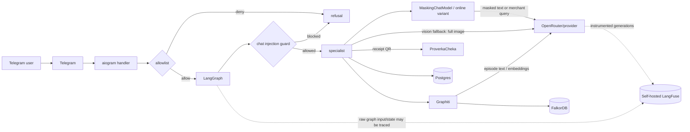

# Безопасность и приватность

Документ описывает реализованные меры и известные ограничения.
Это threat model проекта, а не заявление о сертификации или полном соответствии
ФЗ-152, PCI DSS либо иным требованиям.

## Защищаемые данные

- банковские выписки, транзакции, суммы, категории и merchant names;
- фотографии и фискальные данные чеков;
- Telegram user/chat ids и имя профиля;
- семейные связи, budgets, savings goals и digest schedule;
- данные для оценки налогового вычета, включая годовой доход и медицинские/учебные траты;
- история диалога, LangGraph state, LangFuse traces и Graphiti facts;
- Telegram, OpenRouter, ProverkaCheka, LangFuse и database credentials.

## Границы доверия и получатели данных

| Получатель | Что получает | Контроль проекта |
|---|---|---|
| Telegram | сообщения, документы, фото и ответы бота | Внешний сервис |
| OpenRouter и выбранный model provider | LLM prompts; при vision fallback - полное фото чека; Graphiti extraction/embedding payload; merchant web-search query | Внешний сервис |
| ProverkaCheka | API token и фискальная QR-строка | Внешний сервис |
| Application Postgres | финансовые данные и LangGraph checkpoints | Self-host |
| FalkorDB | производные Graphiti entities/edges | Self-host |
| LangFuse stack | traces, generations, metadata, eval datasets/scores | Self-host |
| Локальная файловая система | исходные uploads и Docker volumes | Self-host |

Self-hosting LangFuse и БД уменьшает число внешних хранилищ, но не отменяет
трансграничные потоки через Telegram, OpenRouter/providers, web-search backend
OpenRouter и ProverkaCheka.

## Реализованные меры

### Telegram access control

Text, document, photo и callback handlers проверяют `TELEGRAM_ALLOWED_USER_IDS`.
Пустой список работает fail-closed и запрещает доступ всем. Пользователь
сопоставляется с локальными `family_id`/`member_id` через `telegram_user_id`.

Текущее ограничение: проверки private chat нет, а checkpoint адресуется только
`thread_id = "tg:<chat_id>"`. В группе любой разрешенный пользователь может попасть
в общий state или возобновить pending interrupt этого чата. Callback проверяет
allowlist вызывающего пользователя, но не связывает кнопку с исходным `member_id`.
Бот не должен использоваться в групповых чатах до проверки chat type, callback owner
и принадлежности checkpoint.

### Tenant scoping

Repository queries используют параметризованный SQL и обязательный `family_id`.
Clarification update дополнительно ограничен набором `import_hashes`. Внутренний
LangGraph получает family context из Telegram mapping, а не из текста пользователя.

MCP - не authorization boundary. Его tools принимают `family_id` от вызывающей стороны
и доверяют ему. Транспорт stdio уменьшает сетевую поверхность, но внешний MCP-клиент
с доступом к процессу должен считаться доверенным.

Merchant rules имеют `family_id`; глобальные seed rules имеют `family_id IS NULL`.
User-confirmed правила и LLM-derived правила различаются полем `source`, но оба могут
автоматически влиять на будущую категоризацию.

### Human-in-the-loop перед изменениями

Массовый импорт парсится до записи и останавливается на `interrupt()` с preview.
`add_many` выполняется только после явного resume `true`; неизвестный ответ трактуется
как отказ. Tax interrupt не пишет финансовые данные и использует частичный ответ
консервативно.

Это снижает риск непреднамеренного bulk write, но interrupt/resume не является
авторизацией. Без private-chat enforcement разрешенный участник общего чата может
ответить на чужую pending форму.

### Upload boundary

Документы принимаются только с расширением `.csv`/`.pdf`, фото - через Telegram photo,
а заявленный Telegram размер ограничен `MAX_UPLOAD_MB` (по умолчанию 20 МБ). Имя
локального файла строится из Telegram `file_unique_id`, а не из пользовательского имени.
PDF определяется по `%PDF-`; остальные принятые документы обрабатываются как CSV.

Ограничения:

- после скачивания фактический размер bytes повторно не проверяется;
- MIME, структура PDF/CSV и decompression/resource limits отдельно не sandbox-ятся;
- uploads сохраняются без TTL и явного `chmod`;
- parser работает в процессе приложения, поэтому malformed file остается DoS surface.

### PII masking перед обычными LLM-вызовами

Модуль:
[`presidio_pii.py`](../src/family_finance/infrastructure/security/presidio_pii.py).
`MaskingChatModel` оборачивает `ChatOpenRouter` и маскирует текстовые части
`HumanMessage` перед `ainvoke` и `with_structured_output`.

Детектируются:

- `PHONE_NUMBER`, включая RU/US regions;
- `CREDIT_CARD` с валидаторами Presidio;
- `EMAIL_ADDRESS`;
- `IBAN_CODE`;
- `IP_ADDRESS`.

Значения заменяются стандартными placeholders Presidio вида `<ENTITY_TYPE>`.
System/AI messages не меняются.

Это не полная анонимизация:

- PERSON/организации/адреса и свободный финансовый контекст не маскируются;
- merchant names обычно не маскируются и могут уходить в обычную модель или web search;
- regex recognizers могут ошибочно принять часть даты или суммы за телефон и наоборот;
- image parts не меняются, поэтому vision fallback отправляет полное фото чека;
- Graphiti использует свой instrumented OpenAI client и не проходит через
  `MaskingChatModel`;
- web lookup проходит через `MaskingChatModel`, но его основной payload - merchant name,
  который не входит в текущий список PII entities;
- LangFuse graph callback может сохранить исходный input/state до маскирования
  конкретного LLM-вызова.

### Prompt-injection guard

Модуль:
[`injection_guard.py`](../src/family_finance/infrastructure/security/injection_guard.py).
Для обычного пользовательского текста `supervisor_node` применяет:

1. Детерминированные RU/EN substring patterns для известных jailbreak-фраз.
2. Keyword-gated LLM judge для более мягких формулировок.

Заблокированный текст завершает run до specialist-ноды. Security evals находятся в
`tests/evals/cases/security/`.

Guard не является универсальным content firewall:

- он проверяет chat text, но не содержимое CSV/PDF, receipt image или Graphiti episode;
- pending upload route выбирается до проверки сгенерированного handler-сообщения;
- `compact_node` может отправить старую историю в summarizer до проверки последнего
  сообщения supervisor-guard-ом;
- непрямые prompt injections в merchant/receipt text могут попасть в downstream LLM;
- keyword gate и pattern matching допускают false negatives и false positives.

### Целостность финансовых данных

- суммы хранятся как `Decimal`/Postgres `NUMERIC`, не `float`;
- SQL параметризован и не строится из пользовательских строк;
- `import_hash` обеспечивает idempotent import;
- bulk import требует явного HITL confirmation до `add_many`;
- update clarification ограничен `family_id` и известными hashes;
- categorization использует constrained `Category` structured output и direction
  вычисляется из категории кодом;
- налоговые суммы считаются pure-domain функцией на `Decimal`, не LLM;
- MCP read-only и сериализует деньги строками;
- domain validators проверяют положительную сумму, direction, confidence и receipt totals.

### Secrets

Settings используют `SecretStr` для API keys и DSN. `.env`, uploads и generated
coverage исключены из git. Секреты не должны попадать в trace metadata, score comments
и логи.

Значения по умолчанию в `.env.example` и `docker-compose.yml` предназначены только
для локальной разработки.

## Потоки данных

## Хранение и удаление

| Данные | Текущее поведение | Риск / требуемая мера |
|---|---|---|
| CSV/PDF/JPEG в `uploads/` | сохраняются по `chat_id`, автоочистки нет | Нужны TTL, cleanup после обработки и restrictive permissions |
| Транзакции, merchant rules и checkpoints/interrupts | persistent Postgres volume | Нужны backup policy, encryption at rest и процедура удаления семьи |
| Graphiti import/receipt facts | persistent FalkorDB volume | Удалять вместе с family data |
| LangFuse traces/datasets | persistent LF volumes | Нужны retention, RBAC и coordinated deletion |
| Логи | stdout/container logs | Не логировать payload/secrets; определить rotation |

`just reset-data` предназначен для локальной разработки и удаляет application data,
checkpoints и FalkorDB content. Он не является production-процедурой и не очищает
uploads, LangFuse traces либо внешние сервисы.

## Network и deployment

Текущий `docker-compose.yml` - dev-конфигурация:

- Postgres, FalkorDB UI, MinIO console и LangFuse UI публикуют локальные порты;
- между локальными контейнерами нет TLS;
- используются известные default passwords и encryption key;
- application-level encryption финансовых полей отсутствует;
- rate limiting и централизованный audit log не реализованы.

Для production нужны как минимум:

- уникальные secrets из secret manager;
- закрытая container network и firewall без публичного Postgres/MinIO/FalkorDB;
- TLS/reverse proxy и authentication для LangFuse;
- encrypted disks/backups и проверенная restore/delete процедура;
- ограниченный runtime user и права на `uploads/`/volumes;
- allowlist исходящих доменов, timeouts и monitoring;
- rate limits и ограничения размера/типа upload;
- повторная проверка фактического upload size и parser resource limits;
- запрет group chats или строгая привязка chat/user/member/checkpoint/callback;
- review и expiration для LLM-derived merchant rules;
- review trace payload и отключение ненужного capture.

## ФЗ-152 и приватность

| Вопрос | Текущее состояние |
|---|---|
| Минимизация явных идентификаторов в обычном LLM text | Частично: regex Presidio |
| Маскирование имен, адресов и изображений | Нет |
| Локальное хранение основной БД | Да |
| Локальное хранение observability | Да, но требует защиты и retention |
| Трансграничная передача | Есть: Telegram, OpenRouter/providers/web search, ProverkaCheka |
| Согласие, уведомления, договоры, локализация и политика удаления | Организационно не реализованы |
| Формальное соответствие ФЗ-152 | Не заявляется |

Для реального production под требования локализации ПДн нужен отдельный legal/security
review и, вероятно, локальный или допустимый по политике inference вместо текущего
OpenRouter path.

## Проверки

- Unit: `tests/unit/test_presidio_pii.py`,
  `tests/unit/test_injection_guard.py`, repository и parser tests.
- Eval: `tests/evals/cases/security/`.
- Integration: Postgres и MCP round-trip tests.

Изменения access control, LLM boundary, upload handling, tenant scoping или trace
capture требуют обновить этот документ и добавить regression test.
